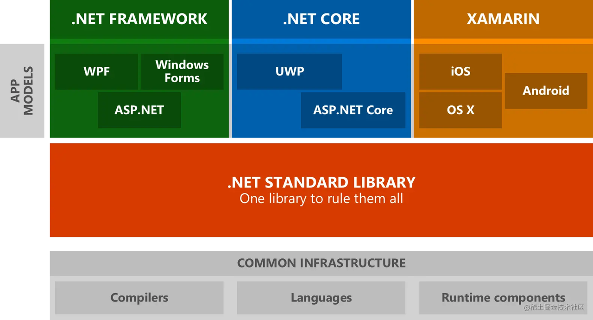

# xamarin

Xamarin是成立于2011年5月的一家美国软件公司，这家公司推出了同名软件xamarin。

xamarin是一个编写跨平台应用的开发工具，通过xamarin工具可以使用原生用户界面编写Android、ios、windows的应用程序。xamarin可以理解为一个跨平台的visual studio，它的核心是一个开发工具。

2016年微软收购了xamarin，xamarin的IDE属性被隐去，与Visual Studio进行了合并。xamarin成了一个跨平台的库。

# .net的实现版本

最初，微软推出.net framework，这是一个与windows强绑定的SDK，开发者只能在windows上使用.netframework开发程序。

之后，另一家公司Xamarin主导开发了Mono项目，实现了使用C#语言在linux、Android、ios等平台下开发应用。Mono虽然有许多缺点，但是率先实现了C#的跨平台使用。

2014年2月4日，微软云计算事业部副总裁萨提亚·纳德拉出任微软第三任CEO，改变微软企业文化，开始开源、拥抱Linux。2015年微软对.NET平台进行了重新设计。2016年，微软收购Xarmarin，紧接着微软推出了跨平台的.net core。2016年6月27日，.NET Core1.0 项目正式发布，彻底改变了 Windows Only 的场景，拥抱开源。同时也得到了全世界开发者的喜爱与支持，很多顶级大牛为.NET Core贡献代码，发展非常迅速，顺势推出了.NET Core1.1、.NET Core2.0、.NET Core2.1、.NET Core2.2、.NET Core3.0、.NET Core 3.1、.NET5，最新推出.NET 6预览版，预计到2021年11月，正式发布.NET6。

综上，.net开发工具集先后出现了三个版本。

- .net framework：最早的.net开发工具集，只支持windows。

- mono（xamarin）：最早的.net跨平台工具集

- .net core：未来微软主推的.net开发工具集

.net 平台三大件：

- 语言：C#，语言天生就是跨平台的，它只是一个标准。

- 开发工具IDE：Visual Studio，这是不太容易跨平台的，虽然现在Mac上也推出了VisualStudio，但是不如Rider好用。

- 基础类库：.net framework。

当我们在谈论.net跨平台的时候，我们实际上就是在谈论.net 基础类库的跨平台，即.net framework的跨平台。

.net core是.net的未来，.net framework和mono都将基于.net core进行构建，.net framework将成为.net core在windows上的发行版。mono将成为.net core的跨平台发行版。

.net6的发行时间：2019年12月。




# 安装使用

csc a.cs

mono a.exe

在Mac上，如果使用的是Visual Studio，生成的exe可以用mono运行。

如果使用的是Rider，生成的exe则只能使用dotnet运行。

Rider的可执行程序使用mono执行报错：

```Plain
Cannot open assembly 'ConsoleApp1': File does not contain a valid CIL image.
```

直接运行生成的exe报错：

```Plain
A fatal error occurred. The required library libhostfxr.dylib could not be found.If this is a self-contained application, that library should exist in [/Users/bytedance/Desktop/ConsoleApp1/ConsoleApp1/bin/Debug/net6.0/].If this is a framework-dependent application, install the runtime in the global location [/usr/local/share/dotnet] or use the DOTNET_ROOT environment variable to specify the runtime location or register the runtime location in [/etc/dotnet].The .NET runtime can be found at:  - https://aka.ms/dotnet-core-applaunch?missing_runtime=true&arch=x64&rid=osx.10.15-x64&apphost_version=6.0.1
```

使用brew 安装了.net 5.0之后报错：

```Plain
It was not possible to find any compatible framework versionThe framework 'Microsoft.NETCore.App', version '6.0.0' was not found.  - The following frameworks were found:      5.0.10 at [/usr/local/Cellar/dotnet/5.0.207/libexec/shared/Microsoft.NETCore.App]You can resolve the problem by installing the specified framework and/or SDK.The specified framework can be found at:  - https://aka.ms/dotnet-core-applaunch?framework=Microsoft.NETCore.App&framework_version=6.0.0&arch=x64&rid=osx.10.15-x64
```

brew install dotnet 这种方式安装的dotnet版本比较老，建议直接去微软官网下载。

export DOTNET_ROOT="/usr/local/opt/dotnet/libexec"

dotnet第一次运行

```Plain
Welcome to .NET 5.0!---------------------SDK Version: 5.0.207Telemetry---------The .NET tools collect usage data in order to help us improve your experience. It is collected by Microsoft and shared with the community. You can opt-out of telemetry by setting the DOTNET_CLI_TELEMETRY_OPTOUT environment variable to '1' or 'true' using your favorite shell.Read more about .NET CLI Tools telemetry: https://aka.ms/dotnet-cli-telemetry----------------Installed an ASP.NET Core HTTPS development certificate.To trust the certificate run 'dotnet dev-certs https --trust' (Windows and macOS only).Learn about HTTPS: https://aka.ms/dotnet-https----------------Write your first app: https://aka.ms/dotnet-hello-worldFind out what's new: https://aka.ms/dotnet-whats-newExplore documentation: https://aka.ms/dotnet-docsReport issues and find source on GitHub: https://github.com/dotnet/coreUse 'dotnet --help' to see available commands or visit: https://aka.ms/dotnet-cli--------------------------------------------------------------------------------------
```

dotnet new console -o why

cd why

dotnet run 编译并运行项目

安装.net6之后，直接运行编译生成的exe即可。

# .net工具栈

- Visual Studio

- Visual Studio Code

- Visual Studio for Mac

- Jetbrains Rider：使用IntelliJ和resharper技术构建

- OmniSharp：在Atom、Sublime、Emacs、vim等编辑器中开发.net

# ASP.NET vs ASP.NET Core

ASP.NET是微软基于.net平台推出的web开发套件。

.net core是新一代.net ASP.NET 基于.net core重新开发之后就叫做asp.net core.

# blazor

基于wasm实现的，使用C#开发前端项目，让C#替代JavaScript执行前端逻辑。

# unity的mono跨平台存在的问题

Unity是一种跨平台的游戏引擎，可以为任何设备开发游戏，开发者无需手动交叉编译、开箱即用就可以编译生成各个平台的游戏。

Unity能够做到编译为各种平台的可执行文件，主要分为两个步骤。第一步把C#编译成中间语言IL；第二步将IL转换成对应平台的二进制编码，所用到的工具即为CLI(Common Language Insfrastructure,通用语言环境结构）。Unity支持的CLI有两种：Mono和il2cpp。

IOS不支持jit编译原因：机器码被禁止映射到内存，即封存了内存的可执行权限，变相的封锁了jit编译方式，详情参考：https://www.cnblogs.com/murongxiaopifu/p/4278947.html

JIT编译：将IL代码转为对应平台原生码并且将原生码映射到虚拟内存中执行。JIT编译的时候IL是在依托Mono运行时，转为对应的原生码后在依托本地运行。

AOT，JIT，Full-AOt三者关系：注意JIT，AOT编译并不是互斥关系，他们可以共存。Mono的AOT模式仍然会保留部分代码在程序运行时采用jit编译，因为ios被禁止了jit，为了解决这个问题，Mono提供了一个被称为Full-AOT的模式。即预先对程序集中所有IL代码进行AOT编译生成一个本地代码映像，然后在运行时直接加载这个映像而不再使用jit。

# 参考资料

.net在Github上的开源项目

https://github.com/orgs/dotnet/repositories?type=all

.net官网教程。

https://dotnet.microsoft.com/zh-cn/learn/dotnet/hello-world-tutorial/create
