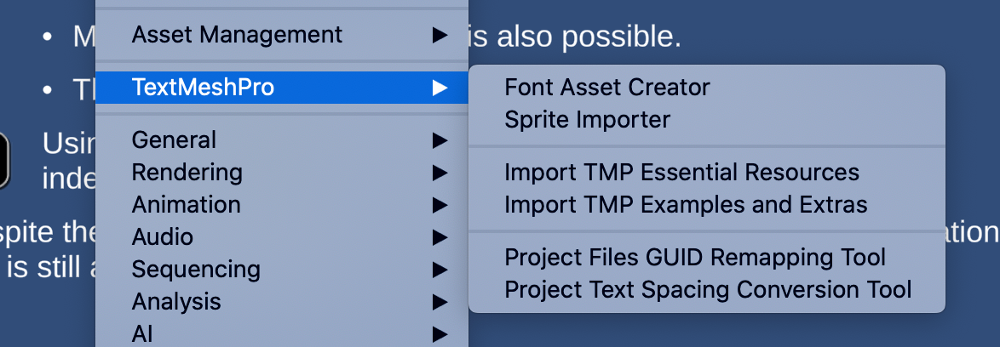

# Unity的UI系统
Unity官方支持三套UI系统。  
* UI Toolkit：也叫UIElements，是Unity最新的UI系统，Unity有意将其作为默认的UI系统，但是目前不够完善。和web、android、javafx、WPF等技术一样，它使用XML定义UI树，使用CSS定义样式。  
* uGUI：是一个较旧的，使用GameObject的UI系统。它最大的优势就是支持拖拽式创建UI界面、支持3D，像处理普通的GameObject那样处理UI元素。  
* IMGUI：Instant Mode GUI，是一个代码驱动的UI工具包。IMGUI就是著名的`data=GUI(data)`这种模式的API，在Unity中用于编写Inspector和EditorWindow。  

两种UI模式：
* 运行时UI，用于游戏内
* GUI扩展UI，用于编写Editor扩展

uGUI只能用于游戏内，IMGUI只能用于编辑器扩展，而UI Toolkit统一了Unity的UI，既能用于游戏内又能用于GUI扩展。  
Unity中经常存在一种东西，多种实现方案。例如UI系统包括UI toolkit、uGUI、IMGUI等。输入系统包括InputSystem和InputManager。  

# UGUI和NGUI的区别
UGUI是unity官方推出的UI库，NGUI是社区实现的改进版的UI，经过一段时间发展，UGUI基本上超越了NGUI。以后不需要再学NGUI了。

1.UGUI界面展示是在画布下(Canvas)，而NGUI是在UIRoot下

2.UGUI继承RectTransform，RectTransform继承Transform，而Ngui直接继承Transform

3.UGUI没有图集Atlas，是直接使用图片，而Ngui需要使用图集，对图集进行管理和维护

4.UGUI有锚点，可以自动适配屏幕，NGUI没有暂未发现此功能

5.UGUI中Btn需要有sprite，button，而NGUI只需要一个UIButton方法，和一个BoxCollider。

6.NGUI基于C#编写的，会产出比较多的GC，UGUI是基于C++，性能比较好。基于canvas渲染比较好。

# unity富文本TMP
在window/textMeshPro中通过import可以导入富文本的资源和实例。
TMP：text mesh pro，是高级版的富文本框。可以灵活地控制字体。
它在ProjectSettings中都有专门的TextMeshPro部分进行设置，在Window菜单中也有专门的入口，因此TMP是比较重要的功能。

