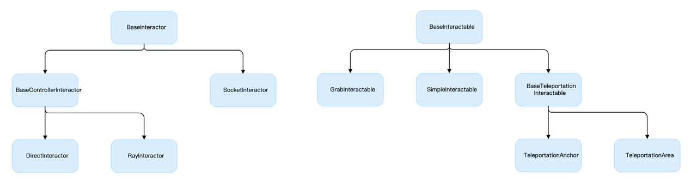
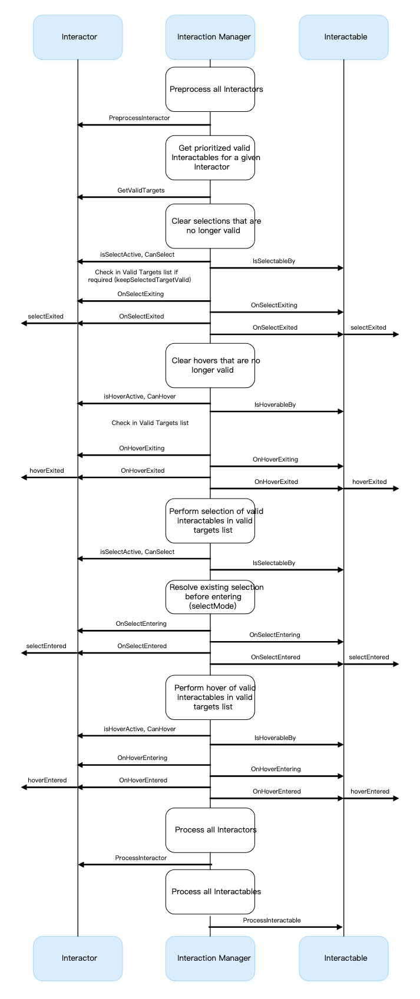

# 参考资料

XR Interaction Toolkit

https://docs.unity3d.com/Packages/com.unity.xr.interaction.toolkit@2.1/manual/index.html

# 概述

[Unity输入关键类](https://bytedance.feishu.cn/docx/doxcnHzP1dgc0hL55j47A31Mfqd)

InputDevices系列是比较低级的API，XRInteractionToolkit则是对InputDevices的封装，提供了更易用的方式。

命名空间：UnityEngine.XR.Interaction.Toolkit

## XRInteractionToolkit的意义

如果直接使用InputDevices写交互式逻辑，就感觉像写汇编语言一样。

**XR** **交互工具包是一个高级的、基于****组件****的交互系统，用于创建 VR 和** **AR** **体验。它提供了一个框架，使** **Unity** **输入事件中的 3D 和** **UI** **交互可用。该系统的核心是一组基本的 Interactor 和 Interactable 组件，以及将这两种类型的组件联系在一起的 Interaction Manager。它还包含可用于运动和绘制视觉效果的组件。**

## XR 交互工具包包含一组支持以下交互任务的组件：

- 跨平台 XR 控制器输入：Meta Quest (Oculus)、OpenXR、Windows Mixed Reality 等。

- 基本对象悬停、选择和抓取

- 通过 XR 控制器进行触觉反馈

- 视觉反馈（色调/线条渲染）以指示可能的和活跃的交互

- 与 XR 控制器的基本画布 UI 交互

- 用于与 XR Origin 交互的实用程序，这是一种用于处理静止和房间规模 VR 体验的 VR 摄像机装置

## 架构

交互系统的三种状态：悬停hovered、选择select、激活activated。这三种状态同时涉及Interactor和interactable，interactable是被交互对象，interactor是触发交互的对象（可以理解为是手柄）。

hover：射线指向了物体

select：例如grip按下

activated：例如trigger按下

Interactable和Interactor





Interactable和Interactor都会在InteractionManager里面进行注册。

## ActionBased和DeviceBased

一些行为，例如[Snap Turn Provider](https://docs.unity3d.com/Packages/com.unity.xr.interaction.toolkit@2.1/manual/locomotion.html#snap-turn-provider)，有两种变体：基于动作的行为和基于设备的行为。基于动作的行为使用[动作](https://docs.unity3d.com/Packages/com.unity.inputsystem@1.3/manual/Actions.html)间接读取来自一个或多个控件的输入。基于设备的行为用于`[InputDevice.TryGetFeatureValue](https://docs.unity3d.com/ScriptReference/XR.InputDevice.TryGetFeatureValue.html)`直接从`[InputDevice](https://docs.unity3d.com/ScriptReference/XR.InputDevice.html)`行为本身配置的特定控件中读取输入。

ActionBased：基于参考的推荐输入类型[行动](https://docs.unity3d.com/Packages/com.unity.inputsystem@1.3/manual/Actions.html)及其在输入系统中的控制器绑定。

DeviceBased：使用InputDevice

建议您使用基于操作的变体而不是基于设备的变体，以利用输入系统包提供的优势。

使用基于操作的变体就是说绑定输入源的时候使用XRI系列。

使用基于设备的变体就是说绑定输入源的时候直接使用Controller。

## 版本问题

Pico Integration SDK中XR SDK的Interaction Toolkit版本是0.9-preview版，目前最新的interaction toolkit版本是2.2。所以导入Pico Integration SDK之后，建议升级一下Interaction SDK。

InGameDebugConsole目前似乎不支持新版的InputManager。

在低版本的XR Interaction Toolkit下，有一些组件是不包含的，例如ContinuousMove和ContinuousTurn。

## 如何升级XR Interaction Toolkit？

在PackageManager里面搜索XR Interaction Toolkit，升级即可，升级完成之后还要安装它提供的一些样例。

升级XR Interaction Toolkit的过程中，注意不要使用新的输入系统（否则会导致很多常用库用不了，现在使用新的输入系统有点早，各个开源库还没有及时跟上）。

# 包含的组件

https://docs.unity3d.com/Packages/com.unity.xr.interaction.toolkit@2.1/manual/components.html

## Controller

手柄相关

XR Controller：包括ActionBased和DeviceBased

XR Controller Recorder

能够把XR控制器的输入转换为事件。

## 交互

### Interactable

为GameObject添加可交互属性

XR Grab Interactable

XR Simple Interactable

### AR Interactables

与AR相关的可交互属性

### Interactors

AR Gesture Interactor

XR Direct Interactor：直接触摸式交互

XR RayInteractor：射线交互

XR Socket Interactor：

## Locomotion

- CharactorControllerDriver

- Continuous (Move+Turn) Provider*(Action Based + Device Based)

- LocomotionSystem

- Snap Turn Provider*（ActionBased + Device Based）

- TeleportationProvider

## Visuals

- XR Interactor Line Visual：射线形状

- XR Interactor Reticle Visual：准星

- XR Tint Interactable Visual

## 其它组件

- InputActionManager

- XR Device Simulator

- XR Interaction Manager

- XR Target Filter

# Interactor&Interactable

## Interaction Manager

是交互管理器，全局唯一。

Interactable和Interactor之间的交互就是由InteractorManager进行管理的。

在一个场景里面Interactor和Interactable都存在很多个，当Interactor发出事件的时候，这个事件应该交给哪一个Interactable来处理，这就是由Interactor Manager处理的。

InteractionManager所面临的一个算法问题：如何快速地匹配Interactor和Interactable？这看上去跟二分图匹配有点像，其实也是要解决一个连线题。




## XRBaseInteractable：一切Interactable的祖先

### 移动类型MovementType

- VelocityTracking

- Kinematic

- Instantaneous

### XRBaseInteractable的成员

- InteractionManager：全局Manager，如果没有设置Manager，则自动寻找全局Manager；如果全局没找到，则创建一个InteractionManager。

- colliders：一个Interactable的碰撞器列表，一个Interactable首先应该包含一个collider列表。当手柄与colliders碰撞的时候，才表示交互发生。如果没有给Interactable设置colliders列表，则默认取所有children中的Collider。

- hoveringInteractors：哪些Interactor在我头上晃悠

- isHovered：是否有人在我头上晃悠

- isSelected：当前interactor是否处于选中状态

事件

- OnFirstHoverEnter

- OnHoverEnter

- OnHoverExit

- OnLastHoverExit

- OnSelectEnter

- OnSelectExit

- OnActivate

- OnDeactivate

方法：

- GetDistanceSqrToInteractor(XRBaseInteractor)：获取interactor到我的距离（我是interactable），我身上挂着多个collider，取interactor到我的collider的最短距离。

所有的XRBaseInteractable都会往InteractionManager里面注册Interactable，相当于告诉Manager说：我是可交互对象，当光线射到我身上的时候，把事件告诉我。

当XRBaseInteractable析构的时候，会从InteractionManager里面取消注册这个Interactable。

### 常见的Interactable

GrableInteractable：可被抓握的对象

BaseTeleportationInteractable：可以去往的对象，与位置相关，下面Locomotion系列会对它进行详细解读。

## XRBaseInteractor：一切Interactor都继承它

XRBaseInteractor是所有Interactor的基类。

Interactor是什么呢？手柄就应该具有Interactor组件，这样手柄才能够触发Interactable。

3D空间中的交互是基于Interactor、Interactable、InteracionManager三个东西的，3D作为一种新的交互形式，Unity走在了时代的前列。

### 成员变量

- InteractionManager：全局的交互管理器，它需要在Manager里面注册Interactor。

- InteractionLayerMask：LayerMask

- attachTransform

- XRBaseInteractable selectTarget：当前选中的对象

- XRBaseInteractable startingSelectedInteractable ：最初选中的interactable，表示在组件Start的时候默认选中的对象

- AllowHover

- AllowSelect

### 事件

- HoverEnter

- HoverExit

- SelectEnter

- SelectExit

### 常见的Interactor

- XRBaseControllerInteractor：基本的手柄Interactor
  
  - Ray Interactor：可以发射射线的Interactor
  
  - Direct Interactor：必须接触的Interactor

- SocketInteractor：？

## XR Grab Interactable：可以被抓握的对象

使用GrabInteractable可以实现隔空取物。隔空取物的两个关键类：

- XR Grab Interactable

- XR Ray Interactor

## XR Simple Interactable：简单交互器

一个空的交互器，啥都没有，仅仅是继承了XRBaseInteractable。

```Java
public class XRSimpleInteractable : XRBaseInteractable
{
}
```

## XRBaseControllerInteractor：基本的手柄交互器

手柄交互器主要设置select、hover时候的一些音效、触感等，至于具体怎么样才能触发select、hover，则交给Ray Interactor和DirectInteractor去处理。

SelectActionTriggerType：以什么方式触发Selection

bool HideControllerOnSelect：在选中的时候是否隐藏Controller

### 音效

bool playAudioClipOnSelectEnter：在选中的时候是否播放音频

AudioClip AudioClipForOnSelectEnter：在选中的时候播放什么音频

bool playAudioClipOnSelectExit：在退出选中的时候是否播放音频

AudioClip AudioClipForOnSelectExit ：在退出选中的时候播放什么音频

bool playAudioClipOnHoverEnter：

AudioClip AudioClipForOnHoverEnter

bool playAudioClipOnHoverExit

AudioClip AudioClipForOnHoverExit

### 触觉

- 触觉的强度、触觉的时长

- selectEnter、selectExit、hoverEnter、hoverExit

## XR Ray Interactor

光线交互器

## XR Direct Interactor

DirectInteractor持有一个Interactable数组，并且记录了每个Interactable到它的距离。

这个Interactable数组表示与这个Interactor正在发生交互的对象。

```Java
// reusable list of valid targetsList<XRBaseInteractable> m_ValidTargets = new List<XRBaseInteractable>();// reusable map of interactables to their distance squared from this interactor (used for sort)Dictionary<XRBaseInteractable, float> m_InteractableDistanceSqrMap = new Dictionary<XRBaseInteractable, float>();
```

XR Direct Interactor的函数主要在维护它的这个Interactable数据库：当triggerEnter时，把Interactable添加进去；当triggerExit时，把Interactable移除掉。

CanHover、CanSelect两个函数则为这个Interactor定制它所能交互的对象。

# Locomotion 运动系列详解

Locomotion系列的主要作用是控制XRRig的移动，使用一个全局的LocomotionSystem来管理XRRig的位置。

LocomotionSystem持有一个LocomotionProvider，LocomotionProvider提供了XRRig的移动方式。

## 传送的基本用法

1. 创建一个Plane作为地面

2. 为地面添加Teleportation Area组件

3. 全局添加LocomotionSystem，它负责管理全局的移动，

4. 为XR-Rig添加TeleportationProvider

5. 为地面的TeleportationArea添加LocomotionSystem

6. 为LocomotionSystem添加XR-Rig，需要告知它移动哪个物体，应该移动XR-Rig

7. 为TeleportationProvider指定LocomotionSystem，这一步其实可以省略，因为它会默认寻找全局的LocomotionSystem

Teleportation Anchor

为地面添加Teleportation Anchor即可，其它步骤同上。

TeleportationArea可以到达任意一个位置，TeleportationAnchor只能到达一个固定位置。

## LocomotionSystem：互斥地管理当前的LocomotionProvider

有一个当前的LocomotionProvider，就像搜狗输入法持有一个当前的输入框一样。

当一个LocomotionProvider持有的时间超过了timeOut时间，则清空互斥性（清空provider成员和超时时间）。

在启动的时候自动寻找XROrigin

```Java
protected void Awake()
{
    if (m_XROrigin == null)        m_XROrigin = FindObjectOfType<XROrigin>();
}
```

provider可以向LocomotionSystem请求锁，然后LocomotionSystem会返回请求锁是否成功。

LocomotionSystem的设计非常值得学习，试想，如果没有LocomotinoSystem，任何脚本都能够随意修改Camera的位置，那么很有可能出现Camera一会儿被A修改，一会儿被B修改，会导致XR-Rig的位置忽左忽右、闪闪烁烁。Unity虽然是单线程执行MonoBehavior，但是依旧需要考虑并发问题。

## LocomotionProvider：提供BeginLocomotion和EndLocomotion的封装

需要为LocomotionProvider指定LocomotionSystem。即便不设置，也会从全局去自动获取。

一般来说，全局只需要有一个LocomotionSystem。

```Java
protected virtual void Awake()
{
    if (m_System == null)        m_System = FindObjectOfType<LocomotionSystem>();
}
```

LocomotionProvider实现了BeginLocomotion和EndLocomotion两个函数用于回调处理，这两个函数会被LocomotionSystem调用。

```Java
protected bool BeginLocomotion()
{
    if (m_System == null)        return false;    var success = m_System.RequestExclusiveOperation(this) == RequestResult.Success;    if (success)        beginLocomotion?.Invoke(m_System);    return success;
}
```

LocomotionProvider的常见用法如下，使用BeginLocomotion和EndLocomotion来获取锁。

```Java
class MyMoveClass:LocomotionProvider{    void myMove(){        if(BeginLocomotion()){            ....            system.xrRig.MoveCamera().....            ....            EndLocomotion();        }    }}
```

LocomotionProvider的子类：

- SnapTurnProvider：使用一个2d轴移动头戴

- TeleportationProvider：实现位置移动

- ContinuousMoveProvider：位置连续移动

- ContinuousTurnProvider：连续转动

## TeleportationProvider：处理TeleportationRequest

继承自LocomotionProvider，这个类只有短短的65行代码。

建议一切的对XRRig的移动都通过TeleportationProvider。

TeleportProvider持有一个TeleportRequest，在Update的时候执行这个TeleportRequest。

```Java
public struct TeleportRequest
{
  public Vector3 destinationPosition;//目标位置  public Quaternion destinationRotation;//目标旋转  public Vector3 destinationUpVector;  public Vector3 destinationForwardVector;  public float requestTime;  public MatchOrientation matchOrientation;//是摄像机匹配还是整个Rig都匹配
}
```

当处理这个请求的时候

```csharp
switch (m_CurrentRequest.matchOrientation)
{
    case MatchOrientation.None:
        xrRig.MatchRigUp(m_CurrentRequest.destinationUpVector);
        break;
    case MatchOrientation.Camera:
        xrRig.MatchRigUpCameraForward(m_CurrentRequest.destinationUpVector, m_CurrentRequest.destinationForwardVector);
        break;
    //case MatchOrientation.Rig:
    //    xrRig.MatchRigUpRigForward(m_CurrentRequest.destinationUpVector, m_CurrentRequest.destinationForwardVector);
    //    break;
}

Vector3 heightAdjustment = xrRig.rig.transform.up * xrRig.cameraInRigSpaceHeight;

Vector3 cameraDestination = m_CurrentRequest.destinationPosition + heightAdjustment;

xrRig.MoveCameraToWorldLocation(cameraDestination);
```

## BaseTeleportationInteractable

TeleportationArea和TeleportationAnchor的基类。

有了这个类，TeleportationArea和TeleportationAnchor实现起来就变得非常简单了，只需要提供一个GenerateTeleportRequest即可。

现在Unity里面流行一种啰里啰嗦的写法：定义一个成员变量先定义一个protected字段，然后使用get set处理这个字段。

```
[SerializeField]
[Tooltip("The teleportation provider that this Teleport interactable will communicate Teleportation Requests to.")]
protected TeleportationProvider m_TeleportationProvider = null;
/// <summary>
/// The teleportation provider that this Teleport interactable will communicate Teleportation Requests to.
/// If no teleportation provider is configured, then on awake the base teleportation interactable will attempt to find a teleportation provider to work with.
/// </summary>
public TeleportationProvider teleportationProvider { get { return m_TeleportationProvider; } set { m_TeleportationProvider = value; } }
```

## BaseTeleportationInteractable

TeleportationArea和TeleportationAnchor的基类。

有了这个类，TeleportationArea和TeleportationAnchor实现起来就变得非常简单了，只需要提供一个GenerateTeleportRequest即可。

现在Unity里面流行一种啰里啰嗦的写法：定义一个成员变量先定义一个protected字段，然后使用get set处理这个字段。


```
[SerializeField]
[Tooltip("The teleportation provider that this Teleport interactable will communicate Teleportation Requests to.")]
protected TeleportationProvider m_TeleportationProvider = null;
/// <summary>
/// The teleportation provider that this Teleport interactable will communicate Teleportation Requests to.
/// If no teleportation provider is configured, then on awake the base teleportation interactable will attempt to find a teleportation provider to work with.
/// </summary>
public TeleportationProvider teleportationProvider { get { return m_TeleportationProvider; } set { m_TeleportationProvider = value; } }
```

BaseTeleportationInteractable包含的字段说明：

- TeleportationProvider

- MatchOrientation：可以指定Camera或者XRRig

- TeleportTrigger：四种触发时机，select（enter+exit）；activate+deactivate

它有一个虚方法：GenerateTeleportRequest，它的所有子类都只需要提供这个方法即可。

这个方法接收两个参数：

- XRBaseInteractor：

- Raycast

BaseTeleportationInteractable的核心逻辑：根据射线，检测是否与colliders相撞。如果找到了collider，则向TeleportationProvider发送移动请求。


```
bool found = false;
for(int i = 0; i < colliders.Count; i++)
{
    if (colliders[i] == raycastHit.collider)
    {
        found = true;
        break;
    }
}

if (found)
{
    TeleportRequest tr = new TeleportRequest();
    tr.matchOrientation = m_MatchOrientation;
    tr.requestTime = Time.time;
    if (GenerateTeleportRequest(interactor, raycastHit, ref tr))
    {
        m_TeleportationProvider.QueueTeleportRequest(tr);
    }
}
```

## TeleportationArea

设置Request的时候，使用Transform自身的方向。

```
protected override bool GenerateTeleportRequest(XRBaseInteractor interactor, RaycastHit raycastHit, ref TeleportRequest teleportRequest)
{          
    teleportRequest.destinationPosition = raycastHit.point;
    teleportRequest.destinationUpVector = transform.up; // use the area transform for data.
    teleportRequest.destinationForwardVector = transform.forward;
    teleportRequest.destinationRotation = transform.rotation;
    return true;
}      
```


## TeleportationAnchor

TeleportationAnchor接受一个Transform组件，当跳转的时候，直接跳转到该transform

```Java
teleportRequest.destinationPosition = m_TeleportAnchorTransform.position;teleportRequest.destinationUpVector = m_TeleportAnchorTransform.up;teleportRequest.destinationRotation = m_TeleportAnchorTransform.rotation;            teleportRequest.destinationForwardVector = m_TeleportAnchorTransform.forward;
```

## SnapTurnProvider：指定一个Controller（手柄），通过手柄实现转动。

snapTurn：急转弯，快速转身。意思是通过手柄上的摇杆快速实现变向。

SnapTurnProvider也是继承自LocomotionProvider，使用它可以实现用手柄的2D轴控制转向。

- turnUsage：控制转动的时候，一定是2D轴。一般的手柄只有一个primaryAxis，但是Unity提供了选项可以使用secondary2DAxis。turnUsage表示使用primaryAxis还是使用secondaryAxis

- Controllers：一个controller数组，表示使用哪一个控制器来执行操作。

- turnAmount：转动量，默认是45度。

- debounceTime：防止调用太频繁，默认500ms

- deadZone：摇杆必须偏移多少才执行转向，跟debounceTime一样，都是为了让输入更精确。

计算旋转的幅度

只允许左右旋转，当摇杆转向前面或者后面的时候，不执行任何操作。当摇杆向左的时候，则向左转45度；当摇杆向右的时候，则向右转45度。

```Java
InputDevice device = controller.inputDevice;

Vector2 currentState;
if (device.TryGetFeatureValue(feature, out currentState))
{
    if (currentState.x > deadZone)
    {
        StartTurn(m_TurnAmount);
    }
    else if (currentState.x < -deadZone)
    {
        StartTurn(-m_TurnAmount);
    }
}
```

执行旋转

```Java
if (Math.Abs(m_CurrentTurnAmount) > 0.0f && BeginLocomotion())
{
    var xrRig = system.xrRig;    if (xrRig != null)    {        xrRig.RotateAroundCameraUsingRigUp(m_CurrentTurnAmount);    }    m_CurrentTurnAmount = 0.0f;    EndLocomotion();
}
```

## ContinuousMoveProvider：连续移动提供者

它能够提供平滑的移动。

```Java
protected virtual Vector3 ComputeDesiredMove(Vector2 input)
{
    if (input == Vector2.zero)
        return Vector3.zero;

    var xrOrigin = system.xrOrigin;
    if (xrOrigin == null)
        return Vector3.zero;

    // Assumes that the input axes are in the range [-1, 1].
    // Clamps the magnitude of the input direction to prevent faster speed when moving diagonally,
    // while still allowing for analog input to move slower (which would be lost if simply normalizing).
    var inputMove = Vector3.ClampMagnitude(new Vector3(m_EnableStrafe ? input.x : 0f, 0f, input.y), 1f);

    var originTransform = xrOrigin.Origin.transform;
    var originUp = originTransform.up;

    // Determine frame of reference for what the input direction is relative to
    var forwardSourceTransform = m_ForwardSource == null ? xrOrigin.Camera.transform : m_ForwardSource;
    var inputForwardInWorldSpace = forwardSourceTransform.forward;
    if (Mathf.Approximately(Mathf.Abs(Vector3.Dot(inputForwardInWorldSpace, originUp)), 1f))
    {
        // When the input forward direction is parallel with the rig normal,
        // it will probably feel better for the player to move along the same direction
        // as if they tilted forward or up some rather than moving in the rig forward direction.
        // It also will probably be a better experience to at least move in a direction
        // rather than stopping if the head/controller is oriented such that it is perpendicular with the rig.
        inputForwardInWorldSpace = -forwardSourceTransform.up;
    }

    var inputForwardProjectedInWorldSpace = Vector3.ProjectOnPlane(inputForwardInWorldSpace, originUp);
    var forwardRotation = Quaternion.FromToRotation(originTransform.forward, inputForwardProjectedInWorldSpace);

    var translationInRigSpace = forwardRotation * inputMove * (m_MoveSpeed * Time.deltaTime);
    var translationInWorldSpace = originTransform.TransformDirection(translationInRigSpace);

    return translationInWorldSpace;
}
```

## ContinuousTurnProvider：连续转向提供者

它能够提供平滑的转向，与snapTurnProvider相对应，SnapTurnProvider是立即转身提供器。

把它的Controller的size设置成1，然后把XRRig里面的LeftController设置进去，通过调整左手柄的primaryAxis就能够实现平滑的旋转。

## 综合的例子

1. 添加XR-Origin

2. 添加Plane，一个地面，为地面添加TeleportationArea

3. 为XR-Origin添加LocomotionSystem，TeleportationProvider，ContinuousTurnProvider_Device（绑定左手手柄）,ContinuousMoveProvider_Device(绑定右手手柄)

4. 为XR-Origin的左右手柄绑定Pico的Prefab。

# 头戴XRRig

任何GameObject都有自己的X轴、Y轴、Z轴。一个GameObject的up指的就是这个GameObject的Y轴正方向，forward指的就是Z轴正方向。

在空间中，制定up和forward两个方向就能够确定一个GameObject的朝向。

XRRig的代码非常值得阅读，看完能够对向量变换有更深的理解。

## XRRig的属性

- Rig base game Object：尽量不要设置这个变量，默认就是当前GameObject。Rig表示相机+手柄

- Camera Floor Offset Object：相机的偏移量，不需要设置，默认是当前GameObject

- Camera GameObject：相机对象

- Tracking Origin Mode：


## Rig和Camera的相对位置

主要学习InverseTransformPoint。每个GameObject都有自己的XYZ坐标系，它看其它物体都能够求出其它物体的坐标。

m_CameraGameObject.transform.InverseTransformPoint(m_RigBaseGameObject.transform.position)

```Java
public float cameraYOffset { get { return m_CameraYOffset; } set { m_CameraYOffset = value; TryInitializeCamera(); } }

/// <summary>Gets the rig's local position in camera space.</summary>
public Vector3 rigInCameraSpacePos { get { return m_CameraGameObject.transform.InverseTransformPoint(m_RigBaseGameObject.transform.position); } }

/// <summary>Gets the camera's local position in rig space.</summary>
public Vector3 cameraInRigSpacePos { get { return m_RigBaseGameObject.transform.InverseTransformPoint(m_CameraGameObject.transform.position); } }

/// <summary>Gets the camera's height relative to the rig.</summary>
public float cameraInRigSpaceHeight { get { return cameraInRigSpacePos.y; } }
```

## 头戴的transform操作：有些操作Rig，有些操作Camera

bool RotateAroundCameraUsingRigUp(float angleDegrees)：绕着竖直方向旋转angleDegrees

bool RotateAroundCameraPosition(Vector3 vector, float angleDegrees)：绕着直线vector旋转angleDegrees

bool MatchRigUp**(**Vector3 destinationUp**)：将相机的y轴角度设置为destinationUp**

```Java
public bool MatchRigUp(Vector3 destinationUp)
{
    if (m_RigBaseGameObject.transform.up == destinationUp)
        return true;

    if (m_RigBaseGameObject == null)
    {
        return false;
    }
    Quaternion rigUp = Quaternion.FromToRotation(m_RigBaseGameObject.transform.up, destinationUp);
    m_RigBaseGameObject.transform.rotation = rigUp * transform.rotation;
    
    return true;
}
```

bool MatchRigUpCameraForward**(**Vector3 destinationUp, Vector3 destinationForward**)：将相机的up和forward分别调整为destinationUp和destinationForward。**

```Java
public bool MatchRigUpCameraForward(Vector3 destinationUp, Vector3 destinationForward)
{
    if (m_CameraGameObject != null && MatchRigUp(destinationUp))
    {
        // project current camera's forward vector on the destination plane, whose normal vector is destinationUp.
        Vector3 projectedCamForward = Vector3.ProjectOnPlane(cameraGameObject.transform.forward, destinationUp).normalized;

        // the angle that we want the rig to rotate is the signed angle between projectedCamForward and destinationForward, after the up vectors are matched. 
        float signedAngle = Vector3.SignedAngle(projectedCamForward, destinationForward, destinationUp);

        RotateAroundCameraPosition(destinationUp, signedAngle);

        return true;
    }

    return false;
}
```

MatchRigUpRigForward

```Java
public bool MatchRigUpRigForward (Vector3 destinationUp, Vector3 destinationForward)
{
    if (m_RigBaseGameObject != null && MatchRigUp(destinationUp))
    {
        // the angle that we want the rig to rotate is the signed angle between the rig's forward and destinationForward, after the up vectors are matched. 
        float signedAngle = Vector3.SignedAngle(m_RigBaseGameObject.transform.forward, destinationForward, destinationUp);

        RotateAroundCameraPosition(destinationUp, signedAngle);

        return true;
    }

    return false;
}
```

MoveCameraToWorldLocation

将相机移动到特定位置

```Java
public bool MoveCameraToWorldLocation(Vector3 desiredWorldLocation)
{
    if (m_CameraGameObject == null)
    {
        return false;
    }

    Matrix4x4 rot = Matrix4x4.Rotate(cameraGameObject.transform.rotation);
    Vector3 delta = rot.MultiplyPoint3x4(rigInCameraSpacePos);
    m_RigBaseGameObject.transform.position = delta + desiredWorldLocation;

    return true;
}
```

# 与手柄有关的脚本：XR Controller

## 属性

- UpdateType：分为Update、BeforeRender、UpdateAndBeforeRender三种，trackedPosDriver需要使用这个字段来判断什么时候采样数据。Update表示Update阶段，BeforeRender表示渲染前。

手柄的模型：

modelPrefab，它是一个Transform类型的变量。

modelTransform：实际上modelPrefab跟modelTransform基本上都是重合的，这个modelTransform的存在使得这两者可以不重合。

三种操作对应的手柄按键：

`enum InteractionTypes {` *`select`*`,` *`activate`*`,` *`uiPress`* `};`

- select：默认是grip，选择物体。

- activate：默认trigger，表示激活物体

- press：UI中的点击操作等，默认是trigger键

动画：

- selectTransition：选中时候的渐变

- DeSelectTransition：取消选中时候的渐变


# Visual：可视化

## XR Interactor Line Visual：射线可视化

这个类也是位于UnityEngine.XR.Interaction.Toolkit命名空间下。

手柄射线的可视化

Reticle：准星。


## XR Interactor Recicle Visual：准星可视化

准星可视化。

# 画布TrackedDeviceGraphicRaycaster

TrackedDeviceGraphicRaycaster使得画布能够接受手柄的射线。

# InputActionManager：基于动作的输入
