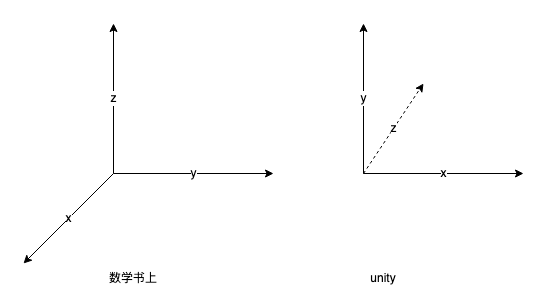

# unity中的坐标系


# 欧拉角
如何描述三维空间中的一个角度？使用欧拉角进行描述
- 绕x轴旋转：俯仰角Pitch
- 绕y轴旋转：偏航角Yaw
- 绕z轴旋转：滚动角Roll

# 四元数Quaternion和旋转
如何描述一个空间角？欧拉角是一种方法。还有一种四元数方法。
四元数表示，绕着某个向量旋转theta角度。右手定则。
四元数用于表示旋转
相对欧拉角的优点：
- 能进行增量旋转
- 避免万向锁
- 给定方位的表达方式有两种，互为负（欧拉角有无数种表达方式）

欧拉角的缺点：
* 万向节锁
* 无法平滑表示角度

# 三种矩阵变换
* 平移
* 缩放
* 旋转

其中平移+缩放叫做错切变换。  
平移+旋转不改变形状，只改变位置。

# 如何描述一个旋转
* 一个变换矩阵和一个轴
* 一个欧拉角矩阵
* 一个四元数


# 用法举例
```plain
transform.rotation = Quaternion.AngleAxis(degrees, transform.right) * transform.rotation;
Vector3 newVector = Quaternion.AngleAxis(90, Vector3.up) * Quaternion.LookRotation(someDirection) * someVector;
```
# 参考资料
https://blog.csdn.net/candycat1992/article/details/41254799

四元数详细推导：
https://zhuanlan.zhihu.com/p/78987582