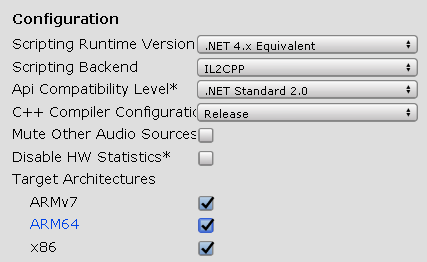
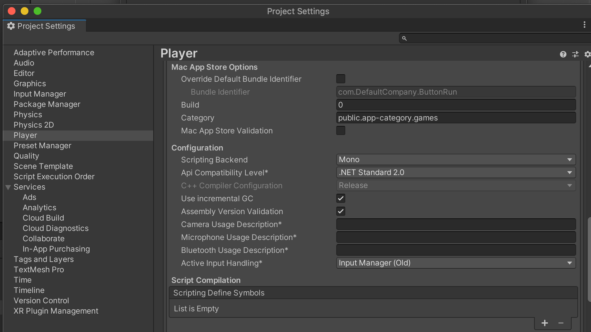
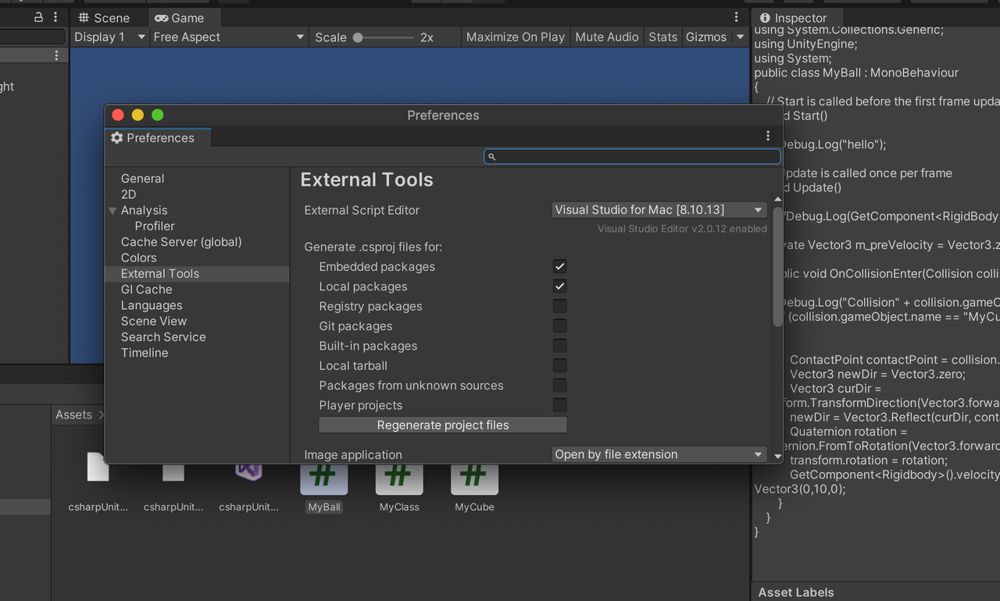

# unity的安卓配置
PlayerSettings中可以设置Manifest/LauncherManifest、GradleTemplate


```
<?xml version="1.0" encoding="utf-8"?>
<manifest
        xmlns:android="http://schemas.android.com/apk/res/android"
        xmlns:tools="http://schemas.android.com/tools"
        package="com.bytedance.platform4unity">

    <application>
        <activity android:name="com.unity3d.player.UnityPlayerActivity" >
            <intent-filter>
                <action android:name="android.intent.action.MAIN" />

                <category android:name="android.intent.category.LAUNCHER" />
            </intent-filter>
        </activity>

    </application>

</manifest>
```


# unity添加so包
直接添加so包，然后再属性里面更改so包的平台信息。

# unity设置android 64bit
Unity要想使用arm64，就必须把Scripting Backend设置成IL2CPP。  
在player settings里面设置：



# unity宏定义
UNITY_EDITOR 编辑器调用。  
UNITY_STANDALONE_OSX 专门为Mac OS（包括  Universal，PPC和Intelarchitectures）平台的定义。
UNITY_DASHBOARD_WIDGET Mac OS Dashboard   widget (Mac OS仪表板小部件)。
UNITY_STANDALONE_WIN Windows 操作系统。  
UNITY_STANDALONE_LINUX Linux的独立的应用程序。  
UNITY_STANDALONE 独立的平台（Mac，Windows或Linux  ）。
UNITY_WEBPLAYER 网页播放器（包括Windows和Mac Web  播放器可执行文件）。
UNITY_WII Wii游戏机平台。  
UNITY_IPHONE iPhone平台。  
UNITY_ANDROID Android平台。  
UNITY_PS3 PlayStation 3。  
UNITY_XBOX360 Xbox 360。  
UNITY_NACL 谷歌原生客户端（使用这个必须另外使用  UNITY_WEBPLAYER）。
UNITY_FLASH Adobe Flash。  

自定义宏在Player/ScriptCompilation中添加。


如果一个C#文件使用了宏，那么一定要注意：不能随便删除未使用的imports。因为未使用的imports可能在宏里面用到了。  
# 设置IDE
