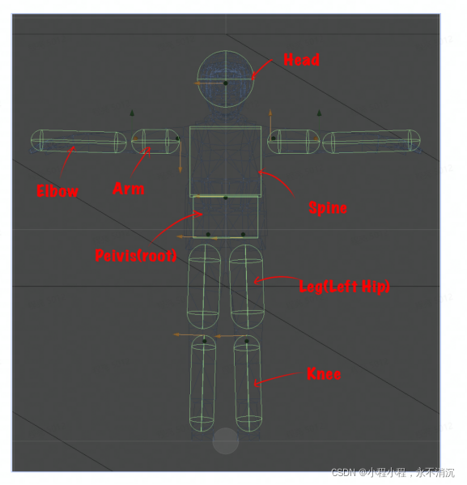
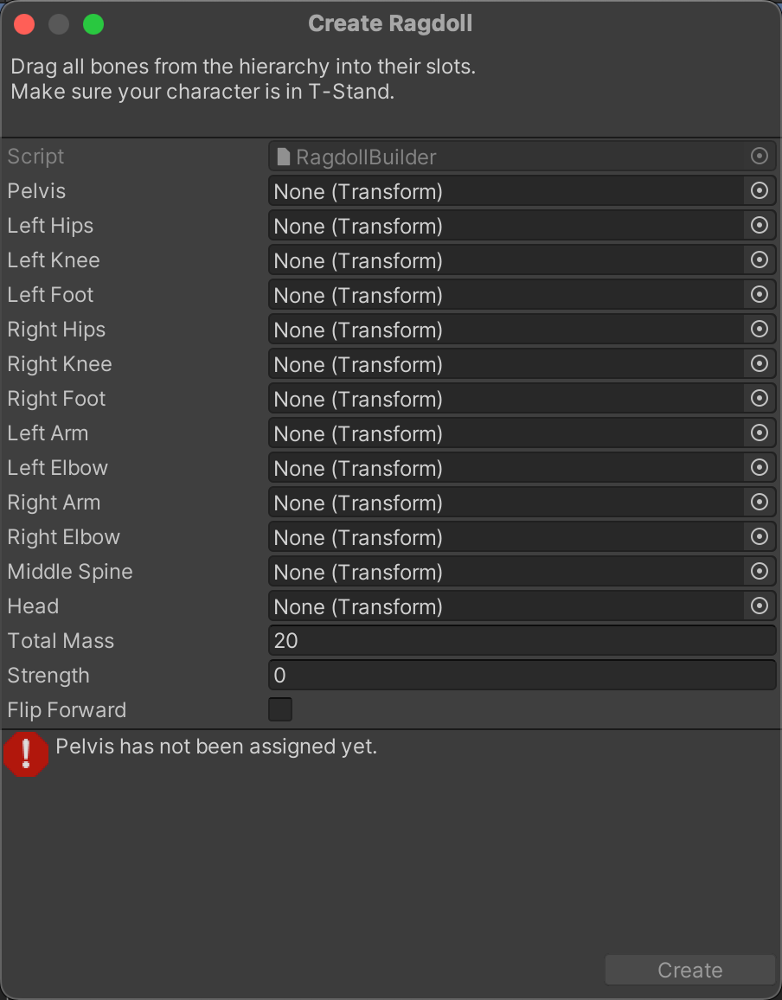
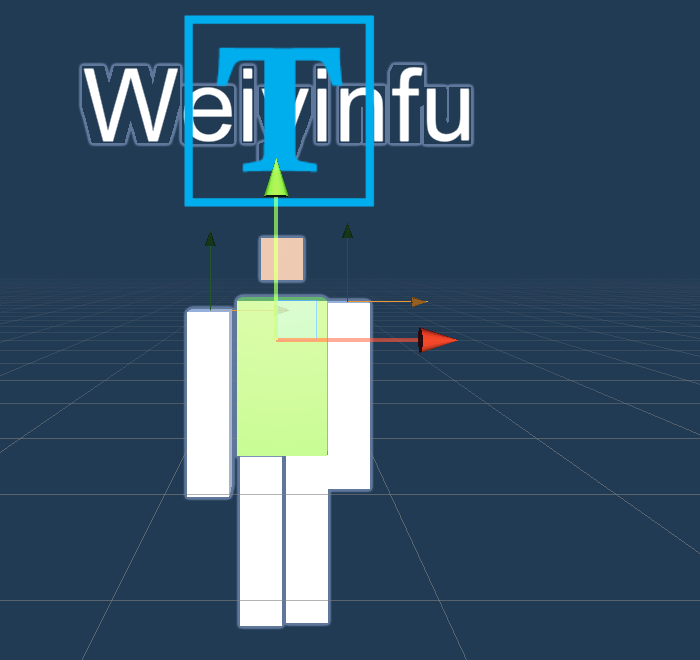

# 布娃娃系统

ragdoll system
通过设置刚体的关节，让人物可以实现走路。  


官方文档：https://docs.unity3d.com/cn/current/Manual/RagdollStability.html

布娃娃系统是游戏中模拟人体运动的一种仿真机制。因为整个设计酷似布娃娃而得名。

动画的实现方式有很多种，而布娃娃系统则是基于物理实现动画，这是一种非常真实的动画生成方式。

# 布娃娃系统的13块骨头

Unity 3D右键创建3D Object，可以直接创建一个布娃娃系统。布娃娃系统创建完成之后，会为指定的13块骨头添加一些刚体属性，布娃娃系统本身并不是一个GameObject，只是一些关系的集合。如果对于刚体比较精通，开发者自己也可以写一个脚本为一堆物体设置刚体属性，这样得到的效果与布娃娃系统是一致的。

如果修改了布娃娃系统的材质，一般需要重新设置布娃娃系统的关系。例如修改了各个骨头的位置、尺寸，都需要重新设置布娃娃系统。

一个布娃娃系统一共有3+2*5=13块大骨头。





pelvis：骨盆

middle spine：脊椎

head：头

四肢：

(left+right)*(hips+knee+foot+arm+elbow)

hips：大腿

knee：小腿

foot：脚丫子

arm：上臂

elbow：下臂

汉语优于英语的地方就在于汉语能够用最少的字描述尽量丰富的意思，使用上下、大小就足以描述一切，而英语却为每一个事物单独起一个名字。



# 注意事项

## 布娃娃系统的坑

播放布娃娃的时候要把animator勾掉，不然不生效

部位穿插拉伸，要把部位Character Joint组件上面的Enable Projection勾上

激活布娃娃弹得很高，就是刚体的速度，把rigidbody的速度置为0

如果布娃娃动作僵硬，肯定用错骨骼来绑定布娃娃导致的

布娃娃穿透场景碰撞的问题，其实这个由于速度太快引起的，可以设置rigidbody的碰撞检测模式collisionDetectionMode

受力不要全部部位都给力，一般都是给一个部位就够了，不然各种力作用引起怪异表现

关于倒地之后抖动问题，这个只能加个检测，如果所有刚体速度小于某个数则关闭刚体功能

## 布娃娃系统的开启和关闭

```C#
using System.Collections;
using System.Collections.Generic;
using UnityEngine;

public class RangdollController : MonoBehaviour {

private Animator Anim;
// Use this for initialization
void Start () {
    Anim = GetComponent<Animator>();
    InitRagdoll();
}

// Update is called once per frame
void Update () {
    
}

public List<Rigidbody> RagdollRigidbodys = new List<Rigidbody>();
public List<Collider> RagdollColliders = new List<Collider>();
/// <summary>
/// 初始化，遍历角色身体上的所有ragdoll并存储 此时关闭布娃娃系统
/// </summary>
void InitRagdoll()
{
    Rigidbody[] Rigidbodys = GetComponentsInChildren<Rigidbody>();
    for (int i = 0; i < Rigidbodys.Length; i++)
    {
        if (Rigidbodys[i] == GetComponent<Rigidbody>())
        {
            //排除正常状态的Rigidbody
            continue;
        }
        //添加Rigidbody和Collider到List
        RagdollRigidbodys.Add(Rigidbodys[i]);
        Rigidbodys[i].isKinematic = true;
        Collider RagdollCollider = Rigidbodys[i].gameObject.GetComponent<Collider>();
        RagdollCollider.isTrigger = true;
        RagdollColliders.Add(RagdollCollider);
    }
}
/// <summary>
/// 启动布娃娃系统
/// </summary>
public void EnableRagdoll()
{
    //开启布娃娃状态的所有Rigidbody和Collider
    for (int i = 0; i < RagdollRigidbodys.Count; i++)
    {
        RagdollRigidbodys[i].isKinematic = false;
        RagdollColliders[i].isTrigger = false;
    }
    //关闭正常状态的Collider
    GetComponent<Collider>().enabled = false;
    //下一帧关闭正常状态的动画系统
    StartCoroutine(SetAnimatorEnable(false));
}
/// <summary>
/// 关闭布娃娃系统
/// </summary>
public void DisableRagdoll()
{
    //关闭布娃娃状态的所有Rigidbody和Collider
    for (int i = 0; i < RagdollRigidbodys.Count; i++)
    {
        RagdollRigidbodys[i].isKinematic = true;
        RagdollColliders[i].isTrigger = true;
    }
    //开启正常状态的Collider
    GetComponent<Collider>().enabled = true;
    //下一帧开启正常状态的动画系统
    StartCoroutine(SetAnimatorEnable(true));
}
IEnumerator SetAnimatorEnable(bool Enable)
{
    yield return new WaitForEndOfFrame();
    Anim.enabled = Enable;
}

```

## 布娃娃系统没有Animator组件

布娃娃系统的使用场景一般只在角色死亡时候有用。

没有Animator组件，意味着该Ragdoll系统只能单纯受物理驱动，无法与动画融合（因此Unity官方也建议仅将该系统用于角色死亡时表现）

## 不要大量使用布娃娃系统

游戏相比普通UI最大的特点就是耗费性能较多，每一帧都需要刷新。

游戏耗费性能体现在渲染上，渲染上耗费性能的两大来源：光照和物理。

物理也是耗费性能的重要来源。物理涉及到刚体计算，如果游戏中刚体特别多，计算量就比较大。

## 通过设置isKinemetic来控制布娃娃的存活和死亡

一般布娃娃需要设置isKinemetic为True，避免让重力打摊布娃娃。

## 最简单的布娃娃系统

最简单的布娃娃系统实际上并不是13块骨头。而是6块骨头。

头、左手、右手、左腿、右腿、躯干。

这是非常自然的、我最初设计的布娃娃系统。



# 问题

### 布娃娃系统一下子就瘫倒在地

把HEAD的isKinemetic设置为True，则头不受重力作用，布娃娃就会站立着。

# 更专业的ragdoll插件：Ragdoll Mecanim Mixer

Ragdoll Mecanim Mixer 插件正是为了解决上面的这些痛点而出现的，对于这些问题，该插件都实现了很好的解决方案（该插件可在Asset Store购买，目前Unity最好的Ragdoll插件之一）

- Ragdoll碰撞体与骨骼分离，不直接关联，降低耦合度

- 基于分离结构，可以分别计算物理变换与动画变换，并实现融合

- 基于一套Ragdoll碰撞体可以预设多种状态，切换简单且可控制过渡平滑度

官方文档：[https://assetstore.altinqiran.kz/ramecan-mixer/files/GUIDE_ENG.pdf](https://links.jianshu.com/go?to=https%3A%2F%2Flink.zhihu.com%2F%3Ftarget%3Dhttps%253A%2F%2Fassetstore.altinqiran.kz%2Framecan-mixer%2Ffiles%2FGUIDE_ENG.pdf)

该插件主要由两个脚本组成

- Ragdoll Constructor

- Ramecan Mixer
